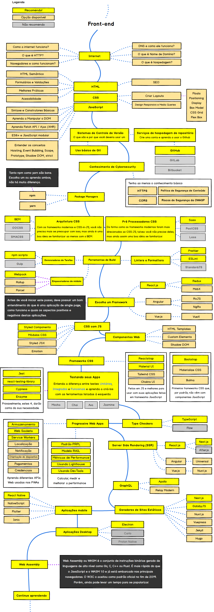

  
  <h1 align="center">Guia do Desenvolvedor Front-end</h1>

## :dart: O guia para alavancar a sua carreira

Abaixo você encontrará conteúdos para te guiar e ajudar a se torna um desenvolvedor front-end, caso você já atue como front-end confere o repositórios para descobrir novas ferramentas para o seu dia-a-dia, os caminhos que você pode tomar e as tecnologias para incorporar na sua stack para se tornar um profissional atualizado e diferenciado em frontend, backend e/ou devops.

 <strong>Segue nas redes sociais para acompanhar mais conteúdo: </strong>  

## :warning: Nossa proposta

> A proposta deste guia é dar uma ideia sobre o atual panorama e guiá-lo se você estiver confuso sobre qual o próximo aprendizado, não influenciar você a seguir os 'hypes' e 'trendys' do momento. Acreditamos que com um <b>maior conhecimento das diferentes estruturas e soluções disponíveis poderá escolher a ferramenta que melhor se aplica às suas demandas.</b> E lembre-se, 'hypes' e 'trendys' nem sempre são as melhores opções.

## :beginner: Para quem está começando agora

> Não se assuste com a quantidade de conteúdo apresentados neste guia. Mesmo o foco sendo para profissionais já consolidados que desejam se manter atualizados, acredito que quem está começando pode usá-lo não como um objetivo, mas como um apoio para os estudos. <b>Neste momento, dê enfoque no que te dá produtividade e o restante marque como <i>Ver depois</i></b>. Ao passo que seu conhecimento se torna mais amplo, a tendência é este guia fazer mais sentido e fácil de ser assimilado. Bons estudos e entre em contato sempre que quiser! :punch:

## :small_blue_diamond: Frontend Roadmap

## ◾ HTML

> HTML (Linguagem de Marcação de HiperTexto) é o bloco de construção mais básico da web. Define o significado e a estrutura do conteúdo da web. Outras tecnologias além do HTML geralmente são usadas para descrever a aparência/apresentação (CSS) ou a funcionalidade/comportamento (JavaScript) de uma página da web, sendo assim HTML é uma linguagem essência para você que quer se tornar desenvolvedor front-end.

- [MDN - HTML](https://developer.mozilla.org/pt-BR/docs/Web/HTML) - O MDN Web Docs é o website oficial de Mozilla para desenvolvimento de padrões web
- [Cursos de HTML](https://github.com/arthurspk/guiadevbrasil#-cursos-de-html-e-css) - Cursos de HTML do repositório geral do Guia Dev Brasil

## ◾ CSS

> CSS (Cascading Style Sheets) é um mecanismo para adicionar estilo a um documento web. O código CSS pode ser aplicado diretamente nas tags ou ficar contido dentro das tags <style>. Também é possível, em vez de colocar a formatação dentro do documento, criar um link para um arquivo CSS que contém os estilos.

- [MDN - CSS](https://developer.mozilla.org/pt-BR/docs/Web/CSS) - O MDN Web Docs é o website oficial de Mozilla para desenvolvimento de padrões web
- [Cursos de CSS](https://github.com/arthurspk/guiadevbrasil#-cursos-de-html-e-css) - Cursos de CSS do repositório geral do Guia Dev Brasil

## ◾ JavaScript

> JavaScript é uma linguagem de programação interpretada estruturada, de script em alto nível com tipagem dinâmica fraca e multiparadigma. Juntamente com HTML e CSS, o JavaScript é uma das três principais tecnologias da World Wide Web.

- [MDN - JavaScript](https://developer.mozilla.org/pt-BR/docs/Web/CSS) - O MDN Web Docs é o website oficial de Mozilla para desenvolvimento de padrões web
- [Cursos de JavaScript](https://github.com/arthurspk/guiadevbrasil#-cursos-de-javascript) - Cursos de JavaScript do repositório geral do Guia Dev Brasil

## ◾ Frameworks

> Framework é um conjunto de códigos prontos que podem ser usados no desenvolvimento de aplicativos e sites. O objetivo dessa ferramenta é aplicar funcionalidades, comandos e estruturas já prontas para garantir qualidade no desenvolvimento de um projeto, cada linguagem possi diversos frameworks que podem ser utilizado para te ajudar em umafuncionalidade específica, por configuração, durante a programação de uma aplicação.

- [Frameworks para HTML](https://www.webfx.com/blog/web-design/html5-frameworks/) - 10 frameworks responsivos para ser utilizado no HTML5
- [Frameworks para CSS](https://rockcontent.com/br/talent-blog/frameworks-css/) - 14 frameworks que podem ser utilizados no seu CSS
- [Frameworks no front-end](https://mundodevops.com/blog/framework-front-end/) - Frameworks mais utilizados no front-end
- [Frameworks e bibliotecas JavaScript](https://blog.geekhunter.com.br/frameworks-javascript-e-bibliotecas-java/#:~:text=Um%20framework%20JavaScript%20%C3%A9%20uma,ficar%20reescrevendo%20linhas%20de%20c%C3%B3digo.) - Frameworks e bibliotecas para ser utilizadas no JavaScript
